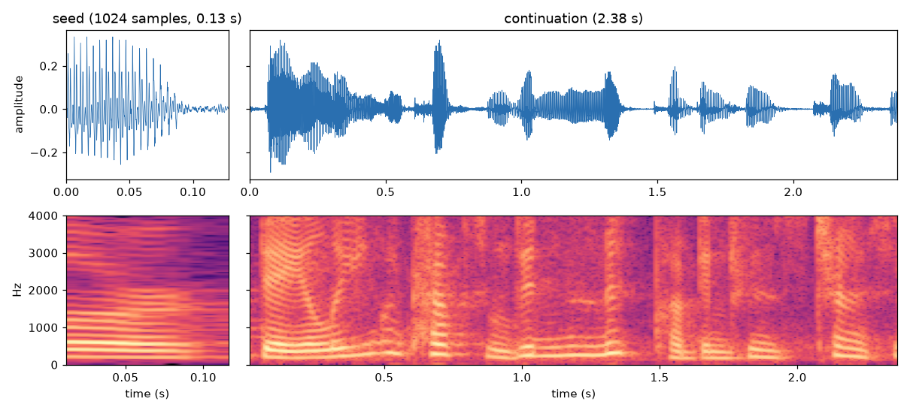

# wavenet

An unconditional WaveNet trained on LJSpeech at 8 kHz with 8-bit mu-law targets.

## Paper

Based on [WaveNet: A Generative Model for Raw Audio](https://arxiv.org/abs/1609.03499) (van den Oord et al., 2016).

## Layout

```text
wavenet/          library code
  data.py         mu-law, clip loading, preprocessing, AudioChunks/MelChunks datasets
  mel.py          log-mel settings, extraction and standardisation
  model.py        CausalConv1d, ResidualBlock, WaveNet (optionally mel-conditioned)
preprocess.py     builds data/{train,val}_8000.pt (or per-clip mels with --mel)
train.py          training loop, saves the best checkpoint by val loss
sample.py         generates clips from a checkpoint and plots spectrograms
samples/          audio samples and figures used in this README
notebooks/        exploration (data inspection, model experiments)
data/             LJSpeech + preprocessed tensors (gitignored)
checkpoints/      saved models (gitignored)
```

## Setup

```sh
uv sync
```

Download [LJSpeech-1.1](https://keithito.com/LJ-Speech-Dataset/) and extract it to `data/LJSpeech-1.1/`, then:

```sh
uv run python preprocess.py              # ~5% of clips held out for validation
uv run python train.py --max-steps 5000
```

Run `uv run python train.py --help` to see the model and training options. Checkpoints store the model config
alongside the weights:

```python
ck = torch.load("checkpoints/ckpt.pt")
model = WaveNet(**ck["config"])
model.load_state_dict(ck["model"])
```

## Results

The best unconditional model so far is `checkpoints/ckpt_bf16.pt`, trained with bf16 mixed precision:

| | |
|---|---|
| Config | `R=128, S=256, n_layers=10, n_stacks=3` |
| Parameters | 3.66M |
| Receptive field | 3,071 samples (384 ms) |
| Training steps | 48,000 |
| Val loss | 2.58 nats/sample (uniform over 256 classes: 5.55) |

### Speech continuation

The model is given a 1,024-sample (0.13 s) clip of real speech, [`seed.wav`](samples/seed.wav), and
generates [`continue_speech.wav`](samples/continue_speech.wav) (2.38 s) sample by sample from there.



The continuation has the right structure for speech: voiced segments with clear harmonics and pitch contours,
fricative-like broadband bursts and pauses between syllables. It isn't intelligible, which is expected because
the model has no text or mel conditioning.
