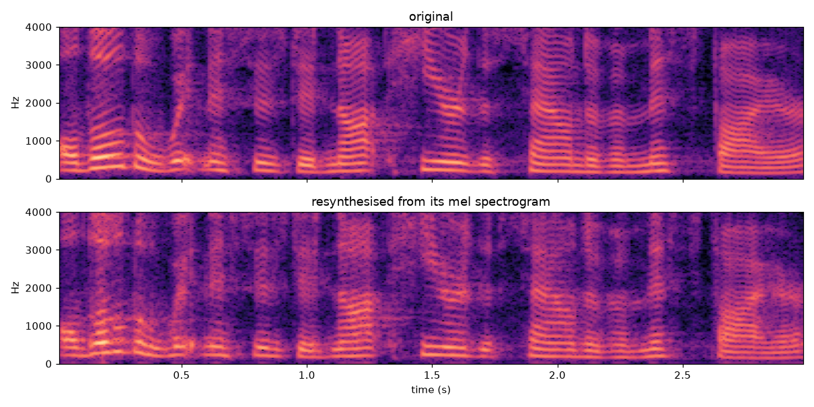
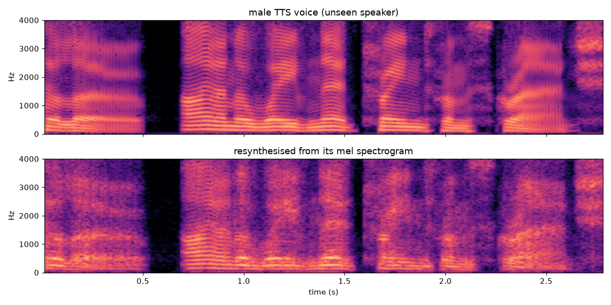

# wavenet

A WaveNet trained on LJSpeech at 8 kHz with 8-bit mu-law targets, either unconditional or conditioned on
log-mel spectrograms as a vocoder.

## Paper

Based on [WaveNet: A Generative Model for Raw Audio](https://arxiv.org/abs/1609.03499) (van den Oord et al., 2016).

## Layout

```text
wavenet/          library code
  data.py         mu-law, clip loading, preprocessing, AudioChunks/MelChunks datasets
  mel.py          log-mel settings, extraction and standardisation
  model.py        CausalConv1d, ResidualBlock, WaveNet (optionally mel-conditioned)
preprocess.py     builds data/{train,val}_8000.pt (or per-clip mels with --mel)
train.py          training loop, saves the best checkpoint by val loss
sample.py         generates clips from a checkpoint and plots spectrograms
samples/          audio samples and figures used in this README
notebooks/        exploration (data inspection, model experiments)
data/             LJSpeech + preprocessed tensors (gitignored)
checkpoints/      saved models (gitignored)
```

## Setup

```sh
uv sync
```

Download [LJSpeech-1.1](https://keithito.com/LJ-Speech-Dataset/) and extract it to `data/LJSpeech-1.1/`, then:

```sh
uv run python preprocess.py              # ~5% of clips held out for validation
uv run python train.py --max-steps 5000
```

For the mel-conditioned vocoder, build the per-clip mel data and train with `--mel`:

```sh
uv run python preprocess.py --mel        # data/{train,val}_8000_mel.pt
uv run python train.py --mel --max-steps 20000
```

Run `uv run python train.py --help` to see the model and training options. Checkpoints store the model config
alongside the weights:

```python
ck = torch.load("checkpoints/ckpt.pt")
model = WaveNet(**ck["config"])
model.load_state_dict(ck["model"])
```

Mel checkpoints also store the train-split `mean` and `std` used to standardise the mels. Use the same stats to
standardise new mels before passing them to the model.

## Results

| | Unconditional (`ckpt_bf16.pt`) | Mel-conditioned (`ckpt_mel.pt`) |
|---|---|---|
| Config | `R=128, S=256, n_layers=10, n_stacks=3` | `R=64, S=128, n_layers=9, n_stacks=2`, 80 mels, hop 128 |
| Parameters | 3.66M | 0.78M |
| Receptive field | 3,071 samples (384 ms) | 1,024 samples (128 ms) |
| Training steps | 48,000 | 20,000 |
| Val loss (nats/sample) | 2.58 | 2.55 |

Val loss is cross-entropy over the 256 mu-law classes; a uniform guess scores 5.55. The unconditional model was
trained with bf16 mixed precision. The mel model beats it with less than a quarter of the parameters, a third of
the receptive field and fewer than half the training steps.

### Mel-conditioned resynthesis

The vocoder is given the mel spectrogram of a held-out clip, [`orig.wav`](samples/mel/orig.wav) (3 s), and
generates [`resynth.wav`](samples/mel/resynth.wav) from it sample by sample, with no access to the original
waveform.



The resynthesis keeps the original's words, timing, pitch contours and formants. The main difference is at the
top of the band, where the higher harmonics are blurrier than in the original.

### Generalising to an unseen voice

LJSpeech is a single female speaker, so as a harder test the vocoder is given the mel spectrogram of a male TTS
voice it has never heard, [`encoded_tts2.wav`](samples/encoded_tts2.wav) (2.8 s), and generates
[`resynth2.wav`](samples/resynth2.wav).



The result sounds like a rough version of the male voice rather than being pulled towards the LJSpeech speaker.
The median pitch stays low, about 129 Hz against 121 Hz in the input, compared with about 193 Hz for the LJSpeech
clip above. The timing, pauses and low harmonics come through intact. Above about 1.5 kHz the harmonics break up
into noise, which gives the voice its rough, breathy quality. So the model has learned a general mapping from mels
to waveforms rather than memorising one speaker, but it is less precise away from the training voice.

### Speech continuation (unconditional)

The unconditional model is given a 1,024-sample (0.13 s) clip of real speech, [`seed.wav`](samples/seed.wav), and
generates [`continue_speech.wav`](samples/continue_speech.wav) (2.38 s) sample by sample from there.


The continuation has the right structure for speech: voiced segments with clear harmonics and pitch contours,
fricative-like broadband bursts and pauses between syllables. It isn't intelligible, which is expected because
the model has no text or mel conditioning.
